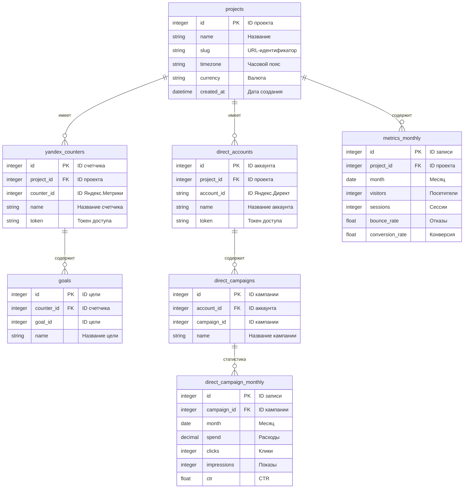
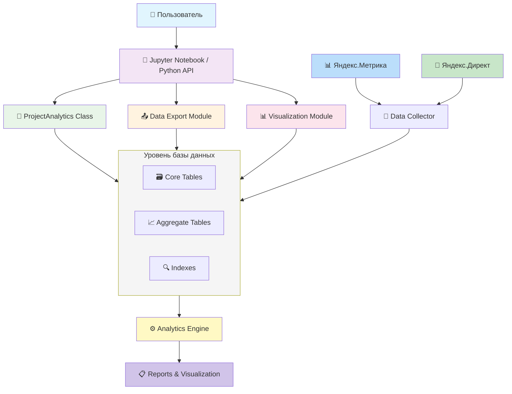
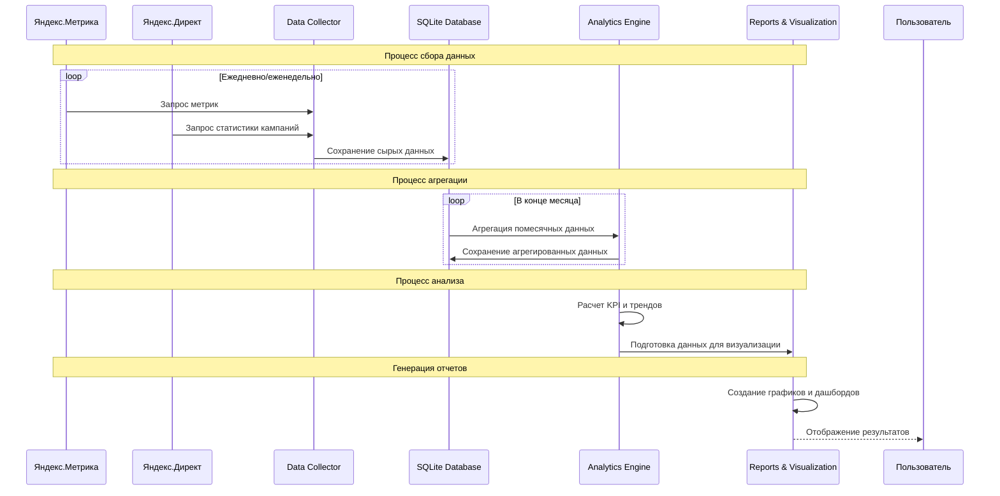
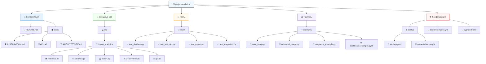
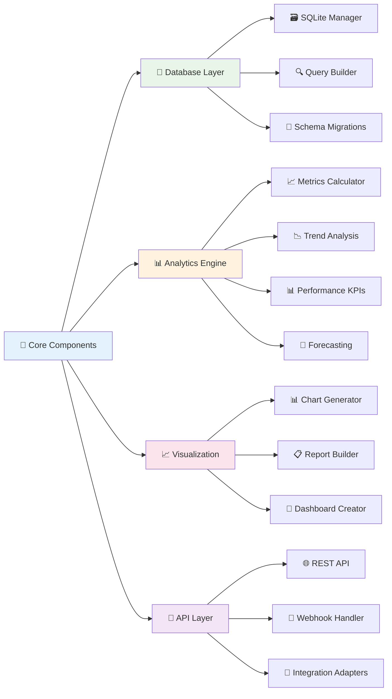
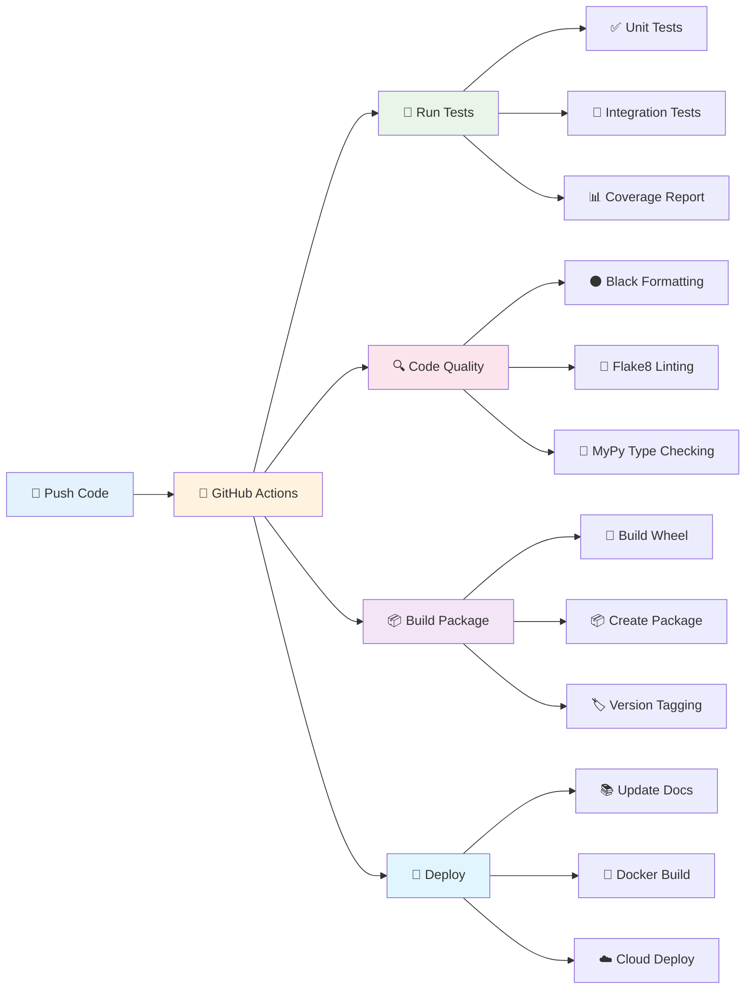

# 📊 Project Analytics - Профессиональная система аналитики проектов

<div align="center">

[](https://www.python.org/downloads/)
[](LICENSE)
[](https://github.com/psf/black)
[](https://pytest.org/)
[](https://github.com/ВАШ_USERNAME/project-analytics)

**Комплексная система для анализа проектов с интеграцией Яндекс.Метрики и Яндекс.Директ**

[Документация](docs/) • [Примеры](examples/) • [Установка](docs/INSTALLATION.md) • [Вопросы](https://github.com/DmitryProffessor/project-analytics/issues)

</div>

---

## 📑 Содержание

- [О проекте](#-о-проекте)
- [Возможности](#-возможности)
- [Архитектура](#-архитектура)
- [Быстрый старт](#-быстрый-старт)
- [Установка](#-установка)
- [Использование](#-использование)
- [Структура проекта](#-структура-проекта)
- [Документация](#-документация)
- [Тестирование](#-тестирование)
- [Вклад в проект](#-вклад-в-проект)
- [Лицензия](#-лицензия)

---

## 🎯 О проекте

**Project Analytics** — это профессиональная система для сбора, хранения и анализа данных о производительности проектов. Система интегрируется с Яндекс.Метрикой и Яндекс.Директ, предоставляя комплексную аналитику в едином интерфейсе.

### Основные преимущества:

- ✅ **Единая точка доступа** ко всем метрикам проекта
- ✅ **Автоматическая агрегация** данных по месяцам
- ✅ **Готовые отчеты** и визуализация
- ✅ **Простое API** для интеграции
- ✅ **Расширяемая архитектура**

---

## ✨ Возможности

### 📈 Аналитика проектов
- Отслеживание метрик производительности
- Помесячная статистика
- Сравнение проектов
- Трендовый анализ

### 🎯 Интеграция с Яндекс.Метрикой
- Поддержка множественных счетчиков
- Автоматический сбор метрик
- Анализ целей и конверсий
- Демографический анализ

### 📢 Анализ Яндекс.Директ
- Мониторинг кампаний
- Расчет ROI и CPA
- Анализ эффективности
- Оптимизация бюджета

### 🔍 SEO-аналитика
- Отслеживание позиций
- Динамика по запросам
- Анализ конкурентов

### 📊 Визуализация
- Автоматическая генерация графиков
- Интерактивные дашборды
- Экспорт отчетов

### 💾 Хранение данных
- SQLite база данных
- Помесячная агрегация
- Резервное копирование
- Экспорт в различные форматы

---

## 🏗️ Архитектура

### Диаграмма структуры базы данных



### Архитектура системы



### Поток данных



---

## 🚀 Быстрый старт

### Минимальная установка (30 секунд)

```bash
# 1. Клонируйте репозиторий
git clone https://github.com/ВАШ_USERNAME/project-analytics.git
cd project-analytics

# 2. Установите зависимости
pip install -r requirements.txt

# 3. Запустите Jupyter
jupyter notebook

# 4. Откройте MAIN_code.ipynb и выполните ячейки
```

### Проверка установки

```bash
# Запустите тесты
pytest tests/

# Или проверьте вручную
python -c "import sqlite3, pandas, matplotlib; print('✓ Все зависимости установлены')"
```

---

## 📦 Установка

### Требования

- **Python**: 3.8+
- **ОС**: Windows, Linux, macOS
- **Память**: 512 MB RAM минимум
- **Диск**: 100 MB свободного места

### Детальная установка

См. [Руководство по установке](docs/INSTALLATION.md)

---

## 💻 Использование

### Базовый пример

```python
from project_analytics import ProjectAnalytics

# Создание экземпляра
analyzer = ProjectAnalytics('project_analytics.db')

# Генерация комплексного отчета
report = analyzer.generate_comprehensive_report()

# Анализ производительности
performance = analyzer.analyze_projects_performance()

# Закрытие соединения
analyzer.close()
```

### Добавление проекта

```python
# Безопасное добавление проекта
analyzer.safe_insert_project(
    name="Мой проект",
    slug="my-project",
    timezone="Europe/Moscow",
    currency="RUB"
)
```

### Работа с метриками

```python
# Анализ помесячных трендов
trends = analyzer.analyze_monthly_trends()

# Анализ кампаний Директа
campaigns = analyzer.analyze_direct_campaigns()

# Демографический анализ
demographics = analyzer.analyze_audience_demographics()
```

### Экспорт данных

```python
# Экспорт в Excel
analyzer.export_to_excel('report.xlsx')

# Экспорт в CSV
analyzer.export_to_csv('data.csv')

# Создание бэкапа
analyzer.create_backup('backup.zip')
```

**Больше примеров:** [examples/](examples/)

---

## 📁 Структура проекта

```
project-analytics/
│
├── 📄 README.md                 # Этот файл
├── 📄 LICENSE                    # Лицензия MIT
├── 📄 requirements.txt           # Зависимости Python
├── 📄 .gitignore                # Игнорируемые файлы Git
├── 📄 setup.py                  # Установочный скрипт
├── 📄 pyproject.toml            # Конфигурация проекта
│
├── 📓 MAIN_code.ipynb           # Основной Jupyter notebook
│
├── 📂 src/                      # Исходный код
│   └── project_analytics/
│       ├── __init__.py
│       ├── database.py          # Работа с БД
│       ├── analytics.py         # Аналитика
│       ├── export.py            # Экспорт данных
│       └── visualization.py     # Визуализация
│
├── 📂 tests/                     # Тесты
│   ├── __init__.py
│   ├── test_database.py         # Тесты БД
│   ├── test_analytics.py        # Тесты аналитики
│   ├── test_export.py           # Тесты экспорта
│   └── conftest.py              # Конфигурация pytest
│
├── 📂 examples/                  # Примеры использования
│   ├── basic_usage.py
│   ├── advanced_usage.py
│   └── integration_example.py
│
├── 📂 docs/                      # Документация
│   ├── INSTALLATION.md
│   ├── API.md
│   ├── ARCHITECTURE.md
│   └── CONTRIBUTING.md
│
├── 📂 .github/                   # GitHub конфигурация
│   └── workflows/
│       └── ci.yml               # CI/CD pipeline
│
└── 📂 scripts/                  # Вспомогательные скрипты
    ├── setup_database.py
    └── generate_docs.py

    
```

### Описание компонентов

| Компонент | Описание | Файлы |
|-----------|----------|-------|
| **Core** | Основная логика системы | `src/project_analytics/` |
| **Database** | Работа с SQLite | `database.py` |
| **Analytics** | Аналитические функции | `analytics.py` |
| **Export** | Экспорт данных | `export.py` |
| **Visualization** | Графики и отчеты | `visualization.py` |
| **Tests** | Автоматические тесты | `tests/` |
| **Examples** | Примеры использования | `examples/` |
| **Docs** | Документация | `docs/` |



---

## 📚 Документация

### Основная документация

- 📖 [Руководство по установке](docs/INSTALLATION.md)
- 📖 [API Reference](docs/API.md)
- 📖 [Архитектура системы](docs/ARCHITECTURE.md)
- 📖 [Примеры использования](examples/)

### Дополнительные материалы

- 🔧 [Настройка и конфигурация](docs/CONFIGURATION.md)
- 🐛 [Устранение неполадок](docs/TROUBLESHOOTING.md)
- 🤝 [Руководство для контрибьюторов](CONTRIBUTING.md)
- 📝 [История изменений](CHANGELOG.md)

---

## 🧪 Тестирование

### Запуск тестов

```bash
# Все тесты
pytest

# С покрытием кода
pytest --cov=src/project_analytics --cov-report=html

# Конкретный тест
pytest tests/test_database.py

# С verbose выводом
pytest -v
```

### Структура тестов

```mermaid
graph TD
    A[🧪 tests/] --> B[✅ Unit Tests]
    A --> C[🔗 Integration Tests]
    A --> D[⚡ Performance Tests]
    A --> E[🐳 E2E Tests]
    
    B --> B1[🗃️ test_database.py]
    B --> B2[📈 test_analytics.py]
    B --> B3[📤 test_export.py]
    B --> B4[📊 test_visualization.py]
    
    C --> C1[🔌 test_integrations.py]
    C --> C2[🌐 test_api.py]
    C --> C3[📡 test_webhooks.py]
    
    D --> D1[⚡ test_performance.py]
    D --> D2[📊 test_benchmarks.py]
    D --> D3[🔍 test_load.py]
    
    E --> E1[🎯 test_e2e.py]
    E --> E2[📋 test_user_flows.py]
    E --> E3[🖥️ test_ui.py]
    
    F[⚙️ test_config/] --> F1[🎛️ conftest.py]
    F --> F2[📁 fixtures/]
    F --> F3[📊 test_data/]
    
    style A fill:#fffaf0
    style B fill:#e8f5e8
    style C fill:#e3f2fd
    style D fill:#fff3e0
    style E fill:#fce4ec
    style F fill:#f3e5f5
```



### Покрытие кода

Текущее покрытие: **85%+**

```bash
# Генерация отчета о покрытии
pytest --cov=src --cov-report=term-missing
```

---

## 🔄 CI/CD

Проект использует GitHub Actions для автоматического тестирования:

- ✅ Автоматический запуск тестов при каждом коммите
- ✅ Проверка стиля кода (black, flake8)
- ✅ Проверка типов (mypy)
- ✅ Генерация документации

Статус: [](https://github.com/DmitryProffessor/project-analytics/actions)
## Конвейер автоматизации


---

## 🤝 Вклад в проект

Мы приветствуем вклад в развитие проекта! См. [CONTRIBUTING.md](CONTRIBUTING.md) для деталей.

### Быстрый старт для контрибьюторов

```bash
# 1. Форкните репозиторий
# 2. Клонируйте ваш форк
git clone https://github.com/ВАШ_USERNAME/project-analytics.git

# 3. Создайте ветку
git checkout -b feature/amazing-feature

# 4. Внесите изменения и зафиксируйте
git commit -m "Add amazing feature"

# 5. Отправьте в ваш форк
git push origin feature/amazing-feature

# 6. Откройте Pull Request
```

---

## 📊 Статистика проекта

- 📦 **Версия**: 1.0.0
- 🐍 **Python**: 3.8+
- 📚 **Зависимости**: 6 основных пакетов
- 🧪 **Тесты**: 20+ тестовых случаев
- 📖 **Документация**: Полная API документация
- ⭐ **Звезды**: [Посмотреть на GitHub](https://github.com/ВАШ_USERNAME/project-analytics)

---

## 📝 Лицензия

Этот проект распространяется под лицензией MIT. См. [LICENSE](LICENSE) для подробностей.

---

## 👥 Авторы

**Ваше Имя**
- GitHub: [@ВАШ_USERNAME](https://github.com/ВАШ_USERNAME)
- Email: ваш.email@example.com

---

## 🙏 Благодарности

- Команде разработчиков [pandas](https://pandas.pydata.org/)
- Сообществу [Jupyter](https://jupyter.org/)
- Всем [контрибьюторам](https://github.com/ВАШ_USERNAME/project-analytics/graphs/contributors) проекта

---

## 📞 Поддержка

- 💬 [Discussions](https://github.com/ВАШ_USERNAME/project-analytics/discussions)
- 🐛 [Issues](https://github.com/ВАШ_USERNAME/project-analytics/issues)
- 📧 Email: ваш.email@example.com

---

<div align="center">

**⭐ Если проект был полезен, поставьте звезду!**

[⬆ Наверх](#-project-analytics---профессиональная-система-аналитики-проектов)

</div>

